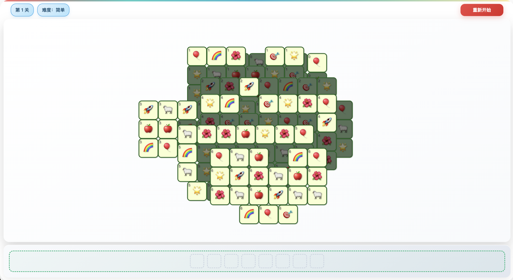

# 羊了个羊简化版

曾经火爆全国的羊了个羊的超级简化版本！

它由智谱AI最新的旗舰模型 GLM-4.5 驱动Claude Code， Vibe Coding 开发获得！

GLM-4.5 的代码生成能力令人印象深刻！几乎达到了 Claude 4 Sonnet 的编程能力！

## 🎮 在线体验

[点击这里](https://cwb660.github.io/match-3-game/) 在线体验

## 🎮 游戏玩法

1. **点击消除** - 点击相同的方块，组成3个消除它们
2. **避免槽位占满** - 如果槽位占满，则游戏结束

## 🚀 运行方法

1. 下载或克隆项目文件
2. 在浏览器中打开 `index.html` 文件
3. 开始游戏！

## 📝 开发心得

GLM-4.5优秀的能力，让游戏开发变得简单！我几乎只需要两个小时就完成了这个游戏！
